# 🥗 Nutrition & Health Tracker Android App

A comprehensive, state-of-the-art Android application for tracking personal nutrition, daily meals, water intake, body weight, BMI, sleep, workouts, AI-assisted health recommendations, food photo scanning, weekly/monthly reports, offline mode, and multi-device cloud synchronization.

---

## 📱 App Screenshots & Feature Showcase

### 🤖 AI Health Features & Local Food Database
| AI Food Photo Scanner | AI Health Assistant | 52+ Local Food Explorer |
|:---:|:---:|:---:|
| 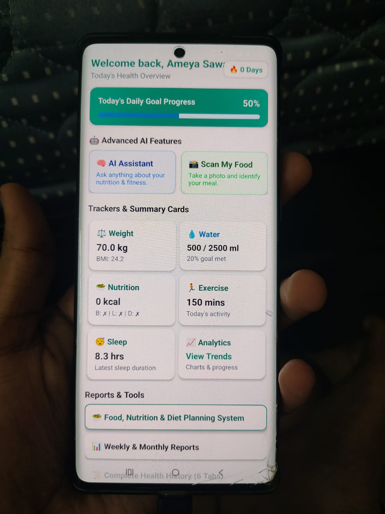 | 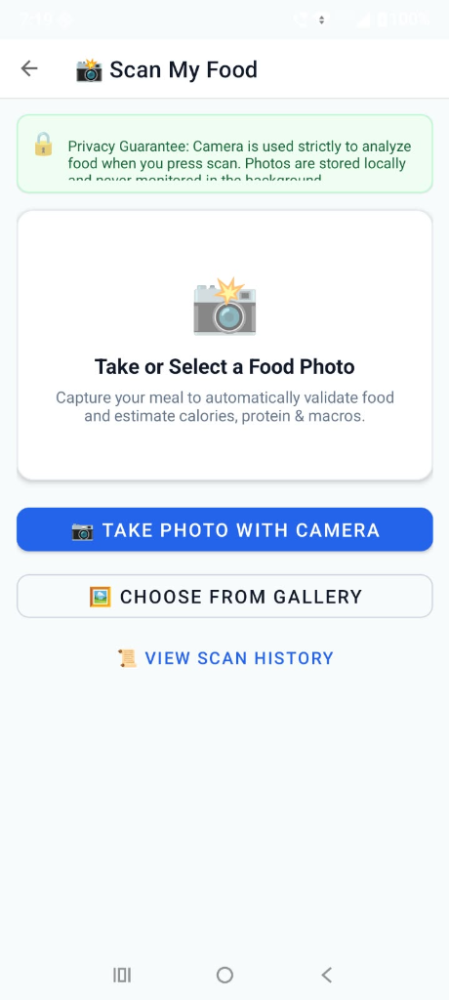 | 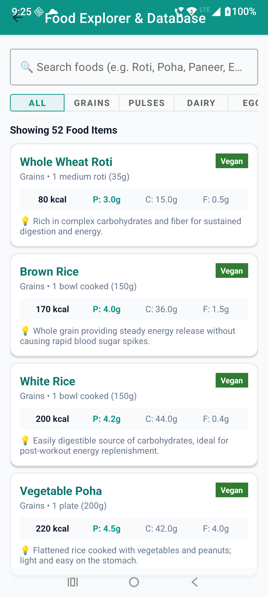 |

### 📊 Personal Health & Tracking Suite
| Main Home Dashboard | Water Intake Tracker | Meal & Calorie Logger |
|:---:|:---:|:---:|
| 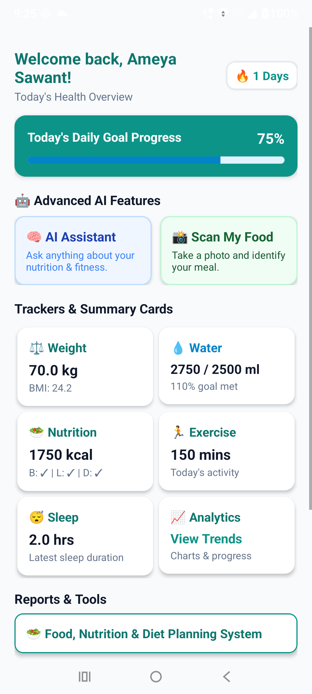 | 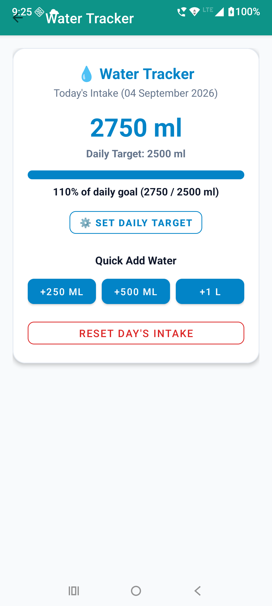 | 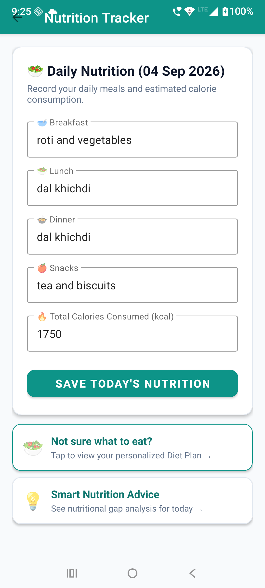 |

| Weight & BMI Tracker | Exercise & Workouts | Sleep Duration & Quality |
|:---:|:---:|:---:|
| 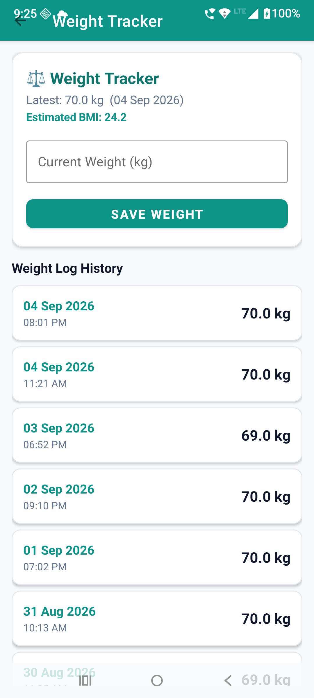 | 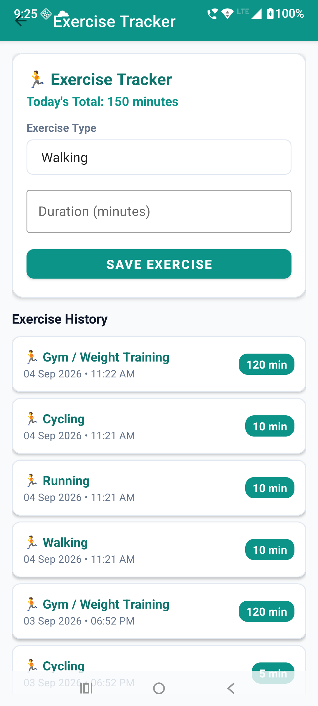 | 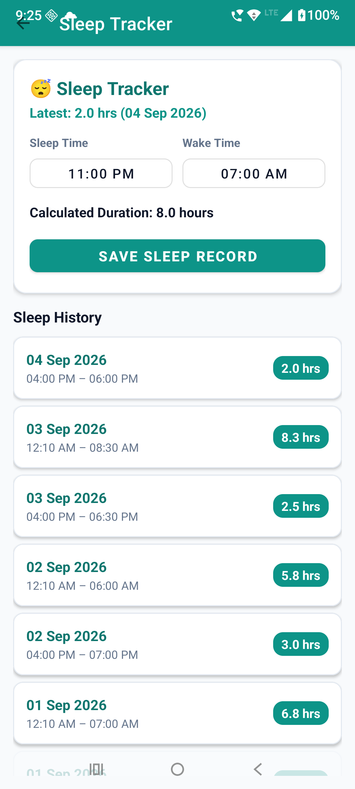 |

| Daily Streaks & Achievements | Standardized Health History | Diet Hub System |
|:---:|:---:|:---:|
| 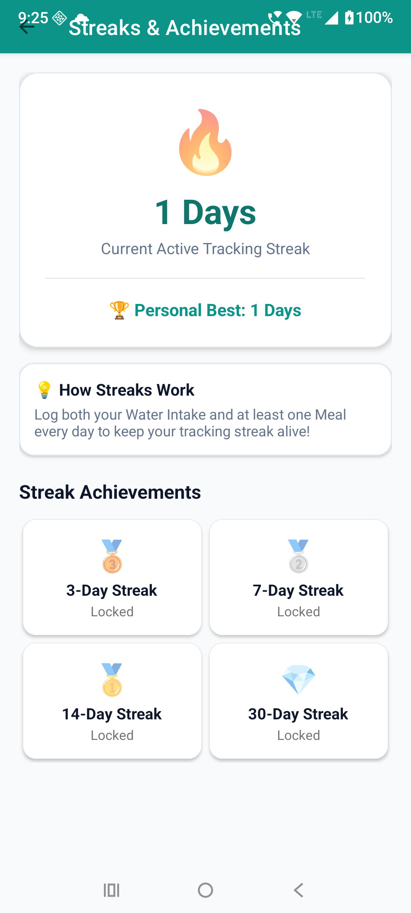 | 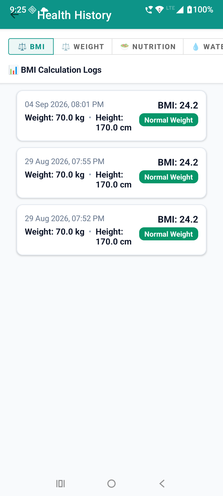 | 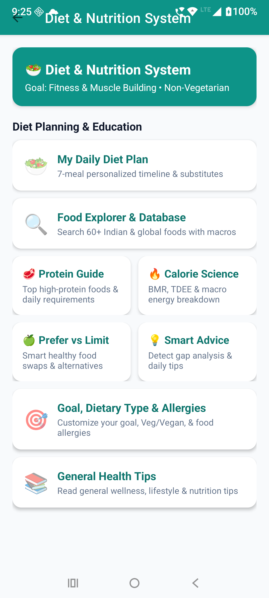 |

### 🗓️ Reports, Multi-Device Sync & Offline Mode
| Saved Reports & Archive | Multi-Device Sync | Complete Offline Banner |
|:---:|:---:|:---:|
| 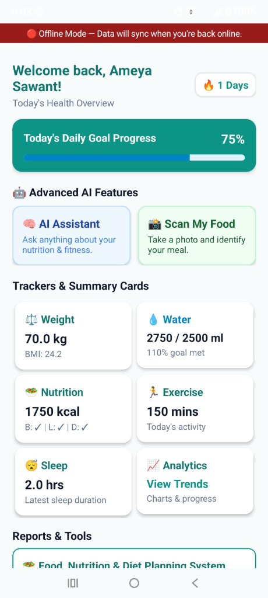 | 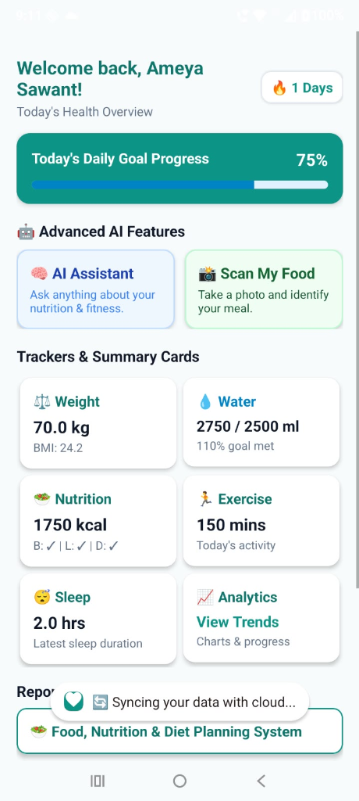 | 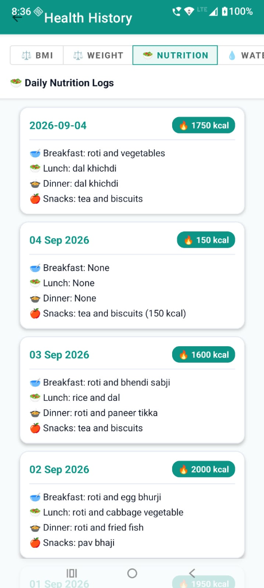 |

### 📄 Data Export, Backup & Themes
| CSV / PDF / Word Exports | Local JSON Backup & Restore | Global Dark Mode Toggle |
|:---:|:---:|:---:|
| 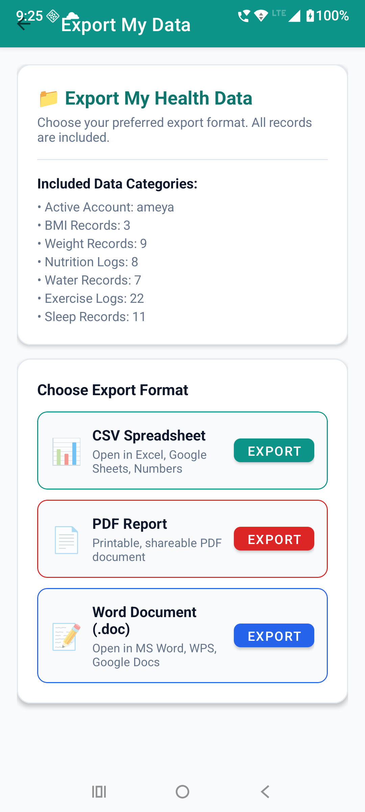 | 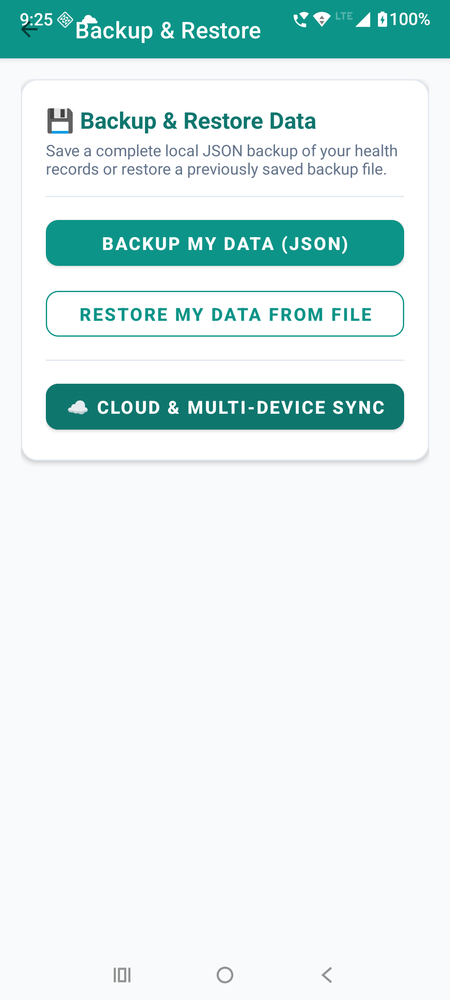 | 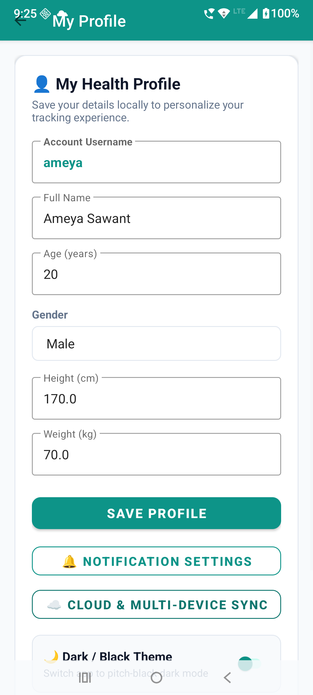 |

---

## 🌟 Key Features

### 📊 1. Personal Dashboard & Trackers
- **Daily Progress**: Real-time completion progress tracking water, meals, workouts, and sleep goals.
- **Streak & Consistency**: Daily logging streak counter (`🔥 X Days`) and milestone achievement badges (7-day, 30-day, 100-day targets).
- **Weight & BMI Tracker**: Weight logging with auto-calculated BMI trends, category classification (*Underweight*, *Normal Weight*, *Overweight*, *Obese*), and weight history log.
- **Water Tracker**: Daily water target tracking (e.g. 2500 ml), quick intake buttons (+250ml, +500ml), and progress bar.
- **Nutrition & Meal Logger**: Calorie intake tracking broken down into **Breakfast**, **Lunch**, **Dinner**, and **Snacks**.
- **Exercise & Sleep Tracker**: Duration logging, workout intensity, bedtime/wake time recording, and sleep quality rating.

---

### 📸 2. AI Food Photo Recognition & AI Assistant
- **Meal Photo Scanner**: Capture meal photos using Camera or Gallery to analyze dishes, portion sizes, calories, and macros.
- **Food Scan History**: Save and view previous meal scans with full nutritional breakdowns.
- **AI Health Assistant**: Contextual AI chatbot bound to your profile, daily goals, macro targets, dietary restrictions, and logged history.

---

### 🥗 3. Diet System & Local Food Database
- **Offline Food Database**: Local database containing **52+ Indian & International staple foods** (Roti, Dal, Paneer, Rajma, Chole, Poha, Idli, Dosa, Khichdi, Biryani, Curd, Oats, Eggs, Chicken, Salads, Fruits, etc.) with complete macro details (Calories, Protein, Carbs, Fat, Fiber, Serving Size).
- **Custom Diet Plan Generator**: Generates customized meal plans based on user goals (*Weight Loss*, *Muscle Building*, *Weight Gain*, *General Health*) and dietary types (*Vegetarian*, *Vegan*, *Non-Veg*).
- **Protein & Calorie Guides**: High-protein food rankings, calorie tables, healthy food choice guides, and smart food substitution recommendations.

---

### 🗓️ 4. Weekly & Monthly Saved Reports
- **Live Health Breakdown**: Computes 7-day (Weekly) and 30-day (Monthly) average water intake, daily calories, sleep duration, exercise minutes, net weight change, and period BMI.
- **Snapshot Saving**: Save report snapshots with a single tap (**"💾 Save Report"**).
- **Report Archive**: Filterable archive (**All**, **Weekly**, **Monthly**) allowing historical comparison across past weeks and months.
- **Detailed Popup View**: Tap any report card to inspect full historical metrics in a detailed breakdown popup dialog.

---

### 🔴 5. Complete Offline Mode
- **Zero Data Loss**: All core features (Dashboard, BMI, Weight, Nutrition, Water, Exercise, Sleep, Diet Plans, Saved Scans, Reports, Health Journal) remain 100% available without internet connection.
- **Dynamic Network Monitor**: Monitors connectivity changes dynamically (`NetworkMonitor`) and displays a top offline status banner (*`🔴 Offline Mode — Data will sync when you're back online.`*) only when internet is disconnected.
- **Graceful Offline AI Handling**:
  - **Food Scanner**: Displays *"Food recognition requires an internet connection."* with two options: **"Try Again When Online"** & **"Enter Food Manually"**. Saved scans remain viewable offline.
  - **AI Assistant**: Displays *"AI Health Assistant is currently unavailable offline. Your saved health data is still available."* without generating fake AI responses.

---

### ☁️ 6. Multi-Device Synchronization & Account System
- **User Authentication**: Sign Up, Login, Logout, Profile Management, and session handling.
- **Background Sync Queue**: Offline modifications are queued as `PendingSyncItem`s with unique `recordId`, `userId`, `deviceId`, and `updatedAt` timestamps.
- **Silent Two-Way Cloud Sync**: Automatically synchronizes queued items upon reconnection without annoying Toast popups.
- **Sync Settings Screen**: Displays Sync Status badge (🟢 Synced / 🟡 Syncing... / 🔴 Sync Error), last synced timestamp, **"Sync Now"** manual trigger button, Auto-sync toggle, Wi-Fi only toggle, **My Registered Devices** list, and **Delete Account** safety confirmation dialog.

---

### 📄 7. Export & Backup System
- **Format-Specific Data Exports**: Export health records to **CSV (`.csv`)**, **PDF (`.pdf`)**, or **Word (`.doc`)** files with Android `FileProvider` sharing.
- **JSON Backup & Restore**: Create full local JSON backups and restore records onto any device.

---

### 🌙 8. Global Dark Mode & Notifications
- **Universal Dark Theme**: One-tap toggle in Profile screen applying custom dark mode styling tokens (`values-night/`) across all features.
- **Scheduled Reminders**: Daily notifications for Water, Meals (Breakfast, Lunch, Dinner), Exercise, Sleep, Weight logging, and Daily progress summary.

---

## 🛠️ Technology Stack

- **Language**: Java 17
- **UI Framework**: Android AppCompat, Material Design Components (`MaterialCardView`, `MaterialButtonToggleGroup`, `SwitchMaterial`)
- **Analytics & Charts**: [MPAndroidChart](https://github.com/PhilJay/MPAndroidChart)
- **Document Generation**: Native Android `PdfDocument` API, RTF Engine for Word `.doc` files
- **Data Storage**: User-Scoped SharedPreferences JSON persistence via `DataManager`
- **Network Monitoring**: `ConnectivityManager.NetworkCallback` (`NetworkMonitor`)
- **File Sharing**: Android `FileProvider`

---

## 📁 Project Structure

```
com.example.nutritionhealthtracker/
│
├── adapters/                  # RecyclerView adapters for history lists & saved reports
│   ├── SavedReportsAdapter.java
│   ├── NutritionHistoryAdapter.java
│   ├── WeightHistoryAdapter.java
│   ├── WaterHistoryAdapter.java
│   ├── SleepHistoryAdapter.java
│   ├── ExerciseHistoryAdapter.java
│   ├── BMIHistoryAdapter.java
│   └── FoodScanHistoryAdapter.java
│
├── models/                    # Data models
│   ├── SavedReport.java
│   ├── PendingSyncItem.java
│   ├── NutritionRecord.java
│   ├── WeightRecord.java
│   ├── BMIRecord.java
│   ├── WaterRecord.java
│   ├── SleepRecord.java
│   ├── ExerciseRecord.java
│   ├── FoodItem.java
│   ├── FoodScanRecord.java
│   └── ChatMessage.java
│
├── utils/                     # Engines, Managers, and Database Helpers
│   ├── DataManager.java
│   ├── NetworkMonitor.java
│   ├── OfflineBannerHelper.java
│   ├── CloudSyncEngine.java
│   ├── SyncQueueManager.java
│   ├── DeviceManager.java
│   ├── FoodDatabase.java
│   ├── FoodRecognitionEngine.java
│   ├── AIHealthAssistantEngine.java
│   ├── DietGenerator.java
│   ├── AlarmScheduler.java
│   └── NotificationHelper.java
│
├── receivers/                 # Broadcast receivers for scheduled reminders & boot restore
│   ├── AlarmReceiver.java
│   └── BootReceiver.java
│
└── Activities                 # App activities (MainActivity, ReportsActivity, FoodScanActivity, etc.)
```

---

## 🚀 Getting Started & Installation Guide

Follow any of the options below to build and run the project on your device or emulator.

---

### 💻 Prerequisites
- **Android Studio**: Jellyfish / Koala or newer (Includes Java 17 JBR)
- **Android Device or Emulator**: Android 7.0 (API Level 24) or higher
- **Git**: Installed on your operating system

---

### Option 1: Open & Run with Android Studio (Recommended / Easiest)

1. **Clone the Repository**:
   ```bash
   git clone https://github.com/ameyasawant07/NutritionHealthTracker.git
   cd NutritionHealthTracker
   ```
2. **Open Project**:
   - Open **Android Studio**.
   - Click **Open** and select the `NutritionHealthTracker` folder.
   - Wait for Gradle sync to complete automatically.
3. **Connect Device or Emulator**:
   - Enable **USB Debugging** on your Android device (`Settings > Developer Options > USB Debugging`) and connect via USB.
   - *Or* create and launch an Android Virtual Device (AVD) emulator from Android Studio Device Manager.
4. **Run Application**:
   - Click the green **Run ▶️** button in top toolbar (or press `Shift + F10`).

---

### Option 2: Build & Install via Command Line (Terminal / PowerShell)

1. **Clone the Repository**:
   ```bash
   git clone https://github.com/ameyasawant07/NutritionHealthTracker.git
   cd NutritionHealthTracker
   ```
2. **Set Java 17 SDK**:
   - **Windows (PowerShell)**:
     ```powershell
     $env:JAVA_HOME="C:\Program Files\Android\Android Studio\jbr"
     ```
   - **macOS / Linux**:
     ```bash
     export JAVA_HOME=$(/usr/libexec/java_home -v 17)
     ```
3. **Build Debug APK**:
   - **Windows**:
     ```powershell
     .\gradlew.bat assembleDebug
     ```
   - **macOS / Linux**:
     ```bash
     chmod +x gradlew
     ./gradlew assembleDebug
     ```
4. **Install onto Device via ADB**:
   - **Windows**:
     ```powershell
     adb install -r "app\build\outputs\apk\debug\app-debug.apk"
     ```
   - **macOS / Linux**:
     ```bash
     adb install -r app/build/outputs/apk/debug/app-debug.apk
     ```

---

### Option 3: Direct APK Installation on Android Smartphone

1. Locate the generated APK at:
   ```
   app/build/outputs/apk/debug/app-debug.apk
   ```
2. Transfer `app-debug.apk` to your phone via USB, Google Drive, or Bluetooth.
3. Open your phone's **File Manager**, tap **`app-debug.apk`**, and select **Install**. *(If prompted, enable "Allow installation from unknown sources").*

---

## 🔒 Privacy & Security
- **Local-First Architecture**: All personal health records are stored locally on your device first.
- **Account Safety**: User data is strictly scoped per user account with explicit confirmation safeguards for account deletion.
- **Data Protection**: Exports and backups are generated securely using standard Android `FileProvider` URIs.

---

## 👤 Developer

Developed & Maintained by **Ameya Sawant**
- 🐙 GitHub: [@ameyasawant07](https://github.com/ameyasawant07)

---

## 📄 License
Copyright © 2026 Nutrition & Health Tracker App. Developed by [Ameya Sawant](https://github.com/ameyasawant07). All rights reserved.
